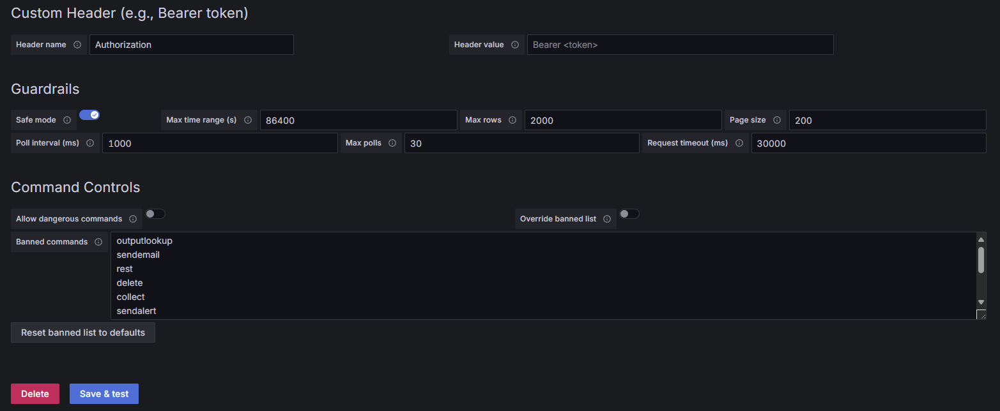

# Splunk Data Source Plugin for Grafana

> ⚠️ **Disclaimer**  
> Experimental plugin — breaking changes likely. Tested in a limited environment.  
> Use in production at your own risk.

---

## Overview

The **Splunk Data Source Plugin for Grafana** lets you query Splunk REST directly from Grafana dashboards — no middleware required.  
It creates a Splunk search job, polls for completion, and pages results through Grafana’s **datasource proxy**.



---

## Installation

```bash
# Example, adjust for your packaging
wget https://github.com/extkljajicm/mnemosyne-splunk-datasource/releases/download/v1.0.0/mnemosyne-splunk-datasource-1.0.0.zip
cd /var/lib/grafana/plugins/
unzip mnemosyne-splunk-datasource-1.0.6.zip
```

For Grafana v8+ allow unsigned plugins in `/etc/grafana/grafana.ini` (or set `GF_PLUGINS_ALLOW_LOADING_UNSIGNED_PLUGINS`):

```ini
allow_loading_unsigned_plugins = mnemosyne-splunk-datasource
```

Restart Grafana.

---

## Configuration

Add via Grafana UI:  
**Configuration → Data Sources → Add data source → “mnemosyne-splunk-datasource”**

Key points:

- **URL**: Use your Splunk management API endpoint (HTTPS, default port **8089**).  
  Example: `https://splunk.yourdomain.com:8089`  
  Grafana will store a proxied base like `/api/datasources/proxy/uid/<UID>` in `instanceSettings.url`. The plugin uses that value directly.
- **Auth**: Basic Auth (username/password) works via Grafana’s Data Source HTTP settings. No bearer token required.
- **TLS**: If using self-signed certs, enable “Skip TLS Verify” (aka `tlsSkipVerify`) in the Grafana data source settings.

> The plugin **never** talks to Splunk directly from the browser; it always uses `getBackendSrv().datasourceRequest(...)`, so all requests route through Grafana’s proxy with your configured auth and TLS options.

---

## Usage

### Panel queries

Write SPL directly in the query editor. Example:

```spl
search index=syslog host="$syslogdevice*"
| eval message = coalesce(message, _raw)
| table _time host message
| sort - _time
| head 50
```

#### Dashboard variable interpolation
- The plugin replaces Grafana variables **before** sending SPL to Splunk.  
- For simple wildcard matching:
  - `host="$device*"` → expands `"$device"` to its value, then `*` is a normal Splunk wildcard.
- For **exact interface** matching (no partials), use a regex against `_raw` (or `message`) that enforces token boundaries **without** consuming the digits or `/` around it:

```spl
search index=syslog host="$syslogdevice*"
| eval message = coalesce(message, _raw)
| regex _raw="(^|[^0-9/])$sysloginterface([^0-9/]|$)"
| table _time host _raw message
| sort - _time
| head 50
```

This ensures `1/0/9` does **not** match `21/0/90`, etc.

#### Time range
The plugin automatically sets `earliest_time`/`latest_time` based on the Grafana panel time picker (ISO 8601).

#### Results mapping
Returned fields are mapped to a Grafana **Table** frame with: `time`, `host`, `message`  
- `time` ← `_time` (or now if missing)  
- `host` ← `host` (or `sourceHost`/`hosts`)  
- `message` ← `message` or `_raw`

### Variables (`$var`) queries
- The **Variable Query Editor** accepts SPL. The first column of the result is used as `{text, value}` for the variable.
- Guardrails prevent dangerous commands by default (e.g., `sendemail`, `outputlookup`, etc.).

---

## Features

- Frontend-only Splunk integration (no backend plugin binary required)
- Works with **Basic Auth** via Grafana’s proxy
- Guardrails:
  - Empty query check
  - Banned commands (configurable), optional override
  - Time range cap (`safeMode`, `maxRangeSeconds`)
  - Pagination (`pageSize`, `maxRows`) and job polling (`pollIntervalMs`, `maxPolls`)
- Variable support with proper interpolation for Grafana 12+

---

## Quickstart

Create a new dashboard, add a **Table** panel and use the query above.  
Use **Inspect → Query inspector** to see the proxied URLs and payloads.

---

## Troubleshooting

**“Unable to find datasource” (404 on `/api/datasources/proxy/uid/...`)**  
- The data source UID in the panel might be stale. Re-select the data source in the panel, or save/reload the dashboard.

**Empty results, but SPL works in Splunk UI**  
- Check variable expansion/quoting. Use `inspect` to confirm the final `search=` body.  
- Try the exact-match example with `regex _raw="(^|[^0-9/])$sysloginterface([^0-9/]|$)"` for interface fields.

**Unexpected token '<' / HTML instead of JSON**  
- You’re likely hitting a reverse proxy/page rather than Splunk’s REST (or not going through Grafana’s proxy). Ensure the request is proxied via `/api/datasources/proxy/uid/<UID>/services/...`.

**Permission or TLS errors**  
- Splunk user must be allowed to run searches via REST.  
- For self-signed certs, enable “Skip TLS Verify”.

---

## FAQ

**Does it support bearer tokens?**  
Yes, but this setup primarily targets **Basic Auth** from Grafana’s HTTP settings.

**Where is “Access = Server” configured?**  
Grafana’s data source HTTP settings and proxy automatically make requests “server-side”. In the plugin, we call `getBackendSrv().datasourceRequest` (no browser direct calls).

**Which Splunk port?**  
The management API is typically **8089** (HTTPS).

---

## License

MIT License © 2025 Marko Kljajic
